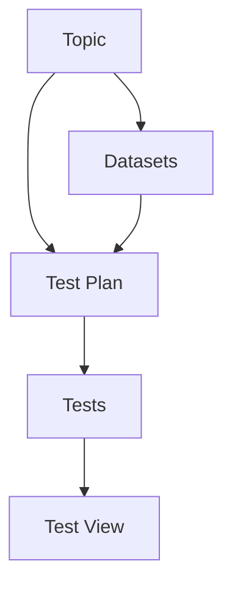

# Open Source Model Benchmarker (OSMB)


The Open Source Model Benchmarker (OSMB) utilizes Streamlit as an advanced viewer to display the results of machine learning model tests. It's important for users to understand that Streamlit in our application does not conduct live or real-time testing but rather serves as a sophisticated interface for viewing and interacting with pre-generated, static test data.

## Test Data Generation

All tests within the OSMB framework are conducted offline on our dedicated machines. This approach allows us to control the testing environment meticulously, ensuring that all variables are managed and consistent, and that the integrity and confidentiality of the data and models are maintained. Here's how our testing process works:

### Offline Testing

1. **Test Execution**: Tests are planned and executed offline using open-source models. This setup includes a range of scenarios and datasets designed to rigorously evaluate each model's performance under various conditions.

2. **Data Collection**: During testing, all outputs, metrics, and other relevant data are collected systematically to ensure comprehensive coverage of test results.

3. **Data Processing**: The raw data obtained from the tests undergoes a thorough cleaning and processing stage, converting it into a format suitable for analysis and display.

### Streamlit as a Data Viewer

Once the data is prepared, it is then hosted on our [Streamlit application](https://osmb-viewer.streamlit.app), which acts as a dynamic viewer:

- **Interactive Visualization**: Streamlit provides an intuitive interface for users to interact with the data. Users can filter, sort, and visualize the test results according to different parameters, enhancing their understanding of the model's performance.

- **Accessibility**: By using Streamlit, we ensure that the test results are accessible in a user-friendly manner, allowing stakeholders to make informed decisions based on solid empirical data.

## Conclusion

The primary role of Streamlit in the OSMB project is to provide a powerful and user-friendly platform for viewing detailed test results that have been generated offline. This separation of data generation and visualization ensures both the reliability of the test results and the efficiency of data exploration for users.

If you have any questions about our testing process or the data presented in the Streamlit app, please feel free to reach out to us.


## Key Concepts

### Topic
A **Topic** in OSMB refers to a broad subject area under which datasets and models are categorized. Topics help organize data and models into meaningful clusters for more efficient analysis. For instance, topics could include areas like `Financial`, `Health`, or `Technology`, each encompassing specific datasets relevant to these fields.

### Dataset
A **Dataset** is a collection of data specifically prepared and structured for analysis in the OSMB project. Each dataset falls under a designated topic and is used to benchmark and analyze the performance of models. Datasets are crucial as they provide the raw material (data points, measurements, statistical information) used in testing model accuracy and effectiveness.

### Test Plan
A **Test Plan** outlines the scope, approach, resources, and schedule of intended test activities. It identifies the features to be tested, the testing tasks, who will perform each task, and any risks requiring contingency planning. In OSMB, a test plan includes various test sets that specify different testing scenarios or configurations under which models are evaluated.

### Tests
**Tests** are specific testing scenarios or conditions defined within a test plan. They detail the parameters and environments in which models are executed to evaluate their performance. Each test set aims to probe different aspects of model behavior, such as response to diverse input types, efficiency, or accuracy, providing a comprehensive view of model capabilities and limitations.

## How It Works

1. **Select a Topic**: Begin by choosing a relevant topic, which categorizes the available datasets.
2. **Choose a Dataset**: Select from datasets associated with the chosen topic, tailored to specific aspects of model evaluation.
3. **Apply Test Plans and Sets**: Engage with different test plans and execute various test sets to measure model performance under controlled scenarios.
4. **Analyze and Visualize Results**: View aggregated results in visual formats and explore detailed data tables to assess model behavior comprehensively.

## Usage

OSMB app is built with Streamlit, ensuring a smooth and responsive user experience. To start using the app, follow these steps:
1. Clone the repository.
2. Install required dependencies.
3. Run the application using Streamlit.

This application is open for contributions and further development. If you are interested in improving OSMB or have suggestions, please refer to the contributing section or open an issue on GitHub.

## Conclusion

OSMB serves as a robust platform for the thorough examination and benchmarking of machine learning models, bringing clarity and insight into model performance across varied datasets and conditions.

## Data Relationships

Below is a Mermaid diagram illustrating the relationships between the different components of the OSMB application:


# Getting Started
To run the OSMB app locally, follow these steps:

## Clone the repository:
```bash
git clone https://github.com/alvincho/osmb.git
```
## Navigate to the app directory:
```bash
cd osmb
````
## Install the required packages:
```bash
pip install -r requirements.txt
````
## Run the Streamlit app:
```bash
streamlit run streamlit_app.py
````
### Contributing
Contributions to OSMB are welcome! Please fork the repository and submit a pull request with your changes. For major changes, please open an issue first to discuss what you would like to change.

# Contributing Your Test Plans or Prompts

We're excited to offer you the opportunity to test your own models or use our system to run simulations based on your custom test plans or prompts. If you have a model or scenario you'd like us to test, please follow the instructions below to submit your test plans or prompts. We look forward to collaborating with you and providing valuable insights into your model's performance!

## How to Submit Your Test Plan or Prompt

### Step 1: Prepare Your Test Plan or Prompt
Before submitting, please ensure your test plan or prompt is clearly defined:
- **For a Test Plan**: Include specific details about the dataset, expected outputs, testing conditions, and any particular metrics for evaluation.
- **For a Prompt**: Outline the scenario or question you want the model to address, including any necessary context or parameters.

### Step 2: Submit Your Test Plan or Prompt
To submit your test plan or prompt, please follow these steps:
1. **Format Your Submission**: Ensure your test plan or prompt is in a readable format, such as a PDF, Word document, or a plain text file.
2. **Email Us**: Attach your document and send it to [alvincho@osmb.ai](mailto:alvincho@osmb.ai) with the subject line "New Test Plan Submission" or "New Prompt Submission".
3. **Include Necessary Details**: In your email, please provide any additional information that might help us understand and implement your test plan or prompt effectively.

### Step 3: Review and Implementation
Upon receiving your submission:
- **Review Process**: Our team will review your test plan or prompt to ensure it aligns with our testing capabilities and standards.
- **Feedback**: We will contact you with any questions or feedback regarding your submission.
- **Testing**: Once approved, we will schedule and run your test, utilizing our resources.

### Step 4: Receive Your Test Results
- **Results Delivery**: After testing, we will provide you with a detailed report of the test results, including performance metrics and insights.
- **Discussion**: We are available to discuss the results and any further testing needs you might have.

## Thank You for Contributing!
Your input is invaluable to us, and we appreciate the opportunity to assist in testing and refining your models. If you have any questions about the submission process or require assistance, please don't hesitate to reach out via email.

We look forward to receiving your submissions and helping you achieve the best performance from your models!


### License
Distributed under the Apache License. See LICENSE for more information.